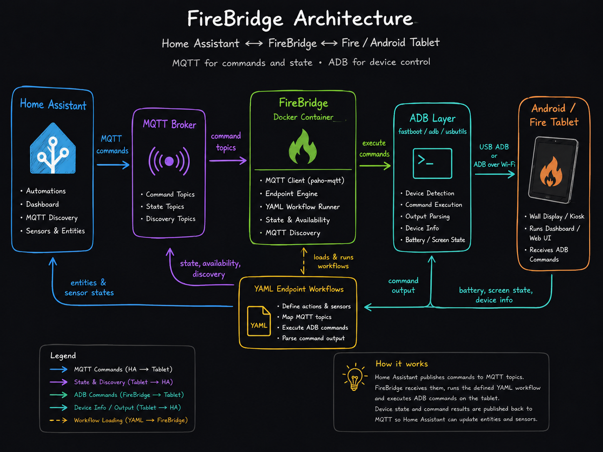

# FireBridge

> **Status: Beta.** APIs, YAML schema, and MQTT topics may still change without notice.



FireBridge is a small Docker-first Python service for controlling an old Amazon Fire tablet over ADB and exposing it cleanly to Home Assistant via MQTT.

The first target device is an Amazon Fire HD 8 5th Gen (`thebes`) running LineageOS, but the service should work with many Android tablets that expose ADB.

## Goals

- Run fully inside a Docker container.
- Configure everything important through environment variables.
- Include all required runtime tools in the image, especially `adb`, `fastboot`, `lsusb`, and basic Linux utilities.
- Define MQTT endpoints as simple YAML workflows mounted into the container.
- Integrate with Home Assistant through MQTT discovery.
- Keep the tablet useful as a wall display without depending on the Home Assistant Android app.
- Support browser/kiosk use cases by opening URLs directly on the device.

## Core Features

- Detect whether the tablet is connected through ADB.
- Load action and sensor endpoints from YAML files.
- Run ordered workflow steps with ADB commands, sleeps, variables, conditional jumps, publishes, returns, and failures.
- Validate text, number, boolean, choice, and JSON inputs from MQTT payloads, environment variables, or defaults.
- Redact secret values such as PINs in dry-run and execution reports.
- Open arbitrary URLs, control display power, set brightness, and read battery through bundled example YAMLs.
- Report battery level, charging status, screen state, and basic device info.
- Reconnect ADB on command and connect to `ADB_TARGET` on startup.
- Publish Home Assistant MQTT discovery entities.

## Quick Start

Create a local environment file:

```bash
cp .env-example .env
```

Edit `.env` and set at least:

```env
MQTT_HOST=homeassistant.local
MQTT_USERNAME=firebridge
MQTT_PASSWORD=change-me
UNLOCK_PIN=change-me
```

Start the service:

```bash
docker compose build && docker compose up
```

Inspect generated Home Assistant MQTT discovery payloads without connecting to MQTT:

```bash
python3 main.py serve --dry-run-discovery
```

The default `compose.yml` mounts `./examples` to `/config/endpoints`, so every example YAML becomes active immediately. Edit `.env` and files in `examples/`, then restart Compose to try changes without rebuilding the image.

## Local Development

Run the test suite:

```bash
python3 -m unittest discover
```

List the currently implemented endpoint-style tools:

```bash
python3 main.py tools list
```

Build a dry-run command plan without touching a real tablet:

```bash
python3 main.py tools run screen.on --dry-run
python3 main.py tools run screen.off --dry-run
python3 main.py tools run url.open --url http://homeassistant.local:8123/lovelace/tablet --dry-run
python3 main.py tools run brightness.set --value 120 --dry-run
```

Run the MQTT bridge locally:

```bash
MQTT_HOST=homeassistant.local python3 main.py serve
```

After installing the package, the same commands are available as `firebridge`:

```bash
firebridge tools list
firebridge serve
```

The files in `./tools` contain the endpoint-style action logic. They are intentionally small and grouped by behavior, for example `tools/screen.py`, `tools/url.py`, `tools/brightness.py`, and `tools/status.py`.

The YAML workflow engine is the primary MQTT integration path. Use these commands to inspect it locally:

```bash
python3 main.py workflows list --config-dir examples
UNLOCK_PIN=change-me python3 main.py workflows run example_display_pin --payload ON --dry-run --config-dir examples
python3 main.py workflows run example_open_url --payload https://example.org --dry-run --config-dir examples
```

## Architecture

```text
Home Assistant
  -> MQTT broker
    -> FireBridge container
      -> adb / fastboot / usbutils
        -> Android / Fire tablet
```

MQTT is the integration path used by the current service. HTTP can be added later for debugging and manual calls.

## Docker Usage

### USB ADB Ownership

When using USB ADB, only one ADB server should own the tablet connection. If the host ADB server already has the tablet open, the container can still see the USB device with `lsusb`, but `adb devices` inside the container may show no devices.

Check the host:

```bash
adb devices -l
```

Check the container:

```bash
docker compose run --rm --entrypoint adb firebridge devices -l
```

If the host sees the tablet but the container does not, stop the host ADB server before starting FireBridge:

```bash
adb kill-server
docker compose up
```

Once the container owns the USB connection, this should show the tablet:

```bash
docker exec firebridge adb devices -l
```

### USB ADB

For a tablet connected over USB, the container needs access to USB devices. The ADB keys should be persisted, otherwise the tablet may ask for USB debugging authorization again after container recreation.

```bash
docker build -t firebridge:latest .

docker run \
  --name firebridge \
  --restart unless-stopped \
  --privileged \
  -v /dev/bus/usb:/dev/bus/usb \
  -v firebridge-adb:/root/.android \
  -v ./examples:/config/endpoints:ro \
  -e MQTT_HOST=homeassistant.local \
  -e MQTT_USERNAME=firebridge \
  -e MQTT_PASSWORD=change-me \
  -e CONFIG_DIR=/config/endpoints \
  -e UNLOCK_PIN=change-me \
  firebridge:latest
```

### ADB Over Wi-Fi

ADB over Wi-Fi avoids USB passthrough after the initial setup.

```bash
docker build -t firebridge:latest .

docker run \
  --name firebridge \
  --restart unless-stopped \
  -v firebridge-adb:/root/.android \
  -v ./examples:/config/endpoints:ro \
  -e ADB_TARGET=192.168.1.50:5555 \
  -e MQTT_HOST=homeassistant.local \
  -e MQTT_USERNAME=firebridge \
  -e MQTT_PASSWORD=change-me \
  -e CONFIG_DIR=/config/endpoints \
  -e UNLOCK_PIN=change-me \
  firebridge:latest
```

## Compose Example

```yaml
services:
  firebridge:
    build: .
    container_name: firebridge
    restart: unless-stopped
    privileged: true
    env_file:
      - .env
    volumes:
      - /dev/bus/usb:/dev/bus/usb
      - firebridge-adb:/root/.android
      - ./examples:/config/endpoints:ro

volumes:
  firebridge-adb:
```

## Environment Variables

### ADB

| Variable | Default | Description |
| --- | --- | --- |
| `ADB_TARGET` | empty | Optional ADB target such as `192.168.1.50:5555`. Empty means USB/local ADB. |
| `ADB_SERIAL` | empty | Optional serial if multiple ADB devices are visible. |
| `ADB_CONNECT_ON_START` | `true` | Run `adb connect` on startup when `ADB_TARGET` is set. |
| `ADB_COMMAND_TIMEOUT` | `10` | Timeout in seconds for individual ADB commands. |

### MQTT

| Variable | Default | Description |
| --- | --- | --- |
| `MQTT_HOST` | required | MQTT broker hostname or IP. |
| `MQTT_PORT` | `1883` | MQTT broker port. |
| `MQTT_USERNAME` | empty | MQTT username. |
| `MQTT_PASSWORD` | empty | MQTT password. |
| `MQTT_CLIENT_ID` | `firebridge` | MQTT client id. |
| `MQTT_BASE_TOPIC` | `firebridge/tablet` | Base topic for commands, state, and availability. |
| `MQTT_DISCOVERY_ENABLED` | `true` | Publish Home Assistant MQTT discovery configs. |
| `MQTT_DISCOVERY_PREFIX` | `homeassistant` | Home Assistant discovery prefix. |
| `MQTT_STATE_INTERVAL` | `30` | Seconds between periodic state publishes. |
| `MQTT_IGNORE_RETAINED_COMMANDS` | `true` | Ignore retained messages received on command topics so old commands are not replayed after restart. |
| `CONFIG_DIR` | `config/endpoints` | Directory containing YAML endpoint files. `compose.yml` sets this to `/config/endpoints` and mounts `./examples` there. |

### Device Behavior

| Variable | Default | Description |
| --- | --- | --- |
| `TZ` | `UTC` | Default timezone used by scheduled YAML endpoints unless `schedule.timezone` is set. |
| `DEVICE_ID` | `firebridge_tablet` | Stable Home Assistant device identifier. |
| `DEVICE_NAME` | `FireBridge Tablet` | Friendly device name. |
| `DEFAULT_URL` | empty | Dashboard or kiosk URL opened by the `open_default_url` command. |
| `BROWSER_PACKAGE` | empty | Optional package name of the browser to use. Empty lets Android choose. |
| `SCREEN_OFF_TIMEOUT_MS` | `2147483647` | Timeout used when display should stay awake. |
| `UNLOCK_PIN` | empty | PIN used by the bundled `display` YAML endpoint. Dry-run output redacts this value. |

### Logging

Logs are written to stderr so `docker logs` and `docker compose logs -f` capture them out of the box. The default text format includes timestamp, level, logger name, message, and structured key/value extras (e.g. `endpoint_id=prod_kiosk duration_ms=312`). Switch to `LOG_FORMAT=json` for one-record-per-line output suitable for log aggregators.

| Variable | Default | Description |
| --- | --- | --- |
| `LOG_LEVEL` | `INFO` | One of `DEBUG`, `INFO`, `WARNING`, `ERROR`, `CRITICAL`. `DEBUG` traces every workflow step and ADB command. |
| `LOG_FORMAT` | `text` | `text` for human-readable output, `json` for structured logs. |
| `LOG_COLOR` | `auto` | `auto` (TTY only), `always`, or `never`. Ignored when `LOG_FORMAT=json`. |

### Security

| Variable | Default | Description |
| --- | --- | --- |
| `ENABLE_RAW_ADB` | `false` | Reserved for a future admin/debug endpoint. Raw ADB is not exposed by the current MQTT bridge. |

## YAML Endpoints

Endpoint files use `version: 1` and can contain either one endpoint or an `endpoints` list. The default `compose.yml` loads all files from `examples/` as active endpoints by mounting that directory to `/config/endpoints`.

The smaller bundled production-style endpoint set is still available in:

- `config/endpoints/display.yaml`
- `config/endpoints/open_url.yaml`
- `config/endpoints/brightness.yaml`
- `config/endpoints/battery.yaml`

Use `config/endpoints` if you want a smaller active set. Use `examples/` if you want all example endpoints active for experimentation.

Example templates currently include display PIN unlock, URL opening, brightness, battery, device verification, app foreground/app selector, immersive mode, kiosk Device Owner setup, volume, and wake/sleep commands.

```bash
python3 main.py workflows list --config-dir examples
UNLOCK_PIN=change-me python3 main.py workflows run example_display_pin --payload ON --dry-run --config-dir examples
python3 main.py workflows run example_immersive_mode --payload full --dry-run --config-dir examples
python3 main.py workflows run example_app_selector --payload Settings --dry-run --config-dir examples
```

The app selector example uses an MQTT `select` entity. Home Assistant MQTT Discovery expects select options in the discovery config, so the package list is static YAML. Edit `examples/app-selector.yaml` to match the apps installed on your tablet.

Minimal action example:

```yaml
version: 1

id: sleep
kind: action
name: Sleep

mqtt:
  command_topic: ${base_topic}/sleep/set

ha:
  component: button
  object_id: sleep
  name: Sleep

steps:
  - adb: shell input keyevent KEYCODE_SLEEP
  - return: ok
```

Input example:

```yaml
inputs:
  brightness:
    type: number
    min: 0
    max: 255
    from_payload: true
    required: true
```

Choice inputs can use simple strings or mappings. For mappings, Home Assistant sees `name`, the workflow receives `value`, and `${input_name_choice.name}` stays available for publishing select state:

```yaml
inputs:
  package:
    type: choice
    from_payload: true
    required: true
    choices:
      - key: home_assistant
        name: Home Assistant
        value: io.homeassistant.companion.android.minimal
```

Schedule example:

```yaml
schedule:
  cron: "* * * * *"
  run_on_start: true
  timezone: Europe/Berlin
  payload: READ
```

FireBridge supports classic 5-field cron syntax. This is minute-based, so the smallest interval is once per minute. Supported field syntax includes `*`, lists like `1,2,3`, ranges like `8-18`, and steps like `*/5`.

Scheduled workflows run inside FireBridge, not through a system cron daemon. They use the same workflow engine as MQTT commands and publish to the configured MQTT state topics.

Supported step types:

- `adb`: run an ADB command, either as a short string or as `args` list.
- `sleep`: sleep in milliseconds.
- `set`: assign variables, including regex extraction from captured output.
- `if`: jump to labels using `equals`, `exists`, or `matches`.
- `jump`: jump directly to a step id.
- `publish`: publish an MQTT message.
- `return`: finish the workflow and optionally publish sensor state.
- `fail`: stop with an error.

Secrets are defined on inputs:

```yaml
inputs:
  pin:
    type: text
    env: UNLOCK_PIN
    secret: true
```

Use `${pin}` in steps; reports and dry-runs show `<redacted>`.

### Home Assistant Discovery Rules

FireBridge publishes MQTT discovery automatically. You should not need to manually create MQTT entities in Home Assistant.

The discovery generator keeps component schemas valid:

- `sensor` and `binary_sensor` get `state_topic`, but never `command_topic`.
- YAML sensors with a `command_topic` automatically get an additional `button` entity to trigger the read action.
- `button` gets `command_topic`, but no `state_topic`.
- `switch`, `number`, `select`, and `text` can get both command and state topics where supported.

`value_template` is only needed if a state topic publishes JSON. The bundled examples publish plain values like `83`, `ON`, or `120`, so no `value_template` is generated for them.

Retained command messages are ignored by default. Discovery messages are still published retained, but incoming retained command messages are skipped so old button presses or retained MQTT Explorer test messages do not run again after FireBridge restarts.

## MQTT Topics

Assuming `MQTT_BASE_TOPIC=firebridge/fire-hd8`:

| Topic | Direction | Payload | Description |
| --- | --- | --- | --- |
| `firebridge/fire-hd8/availability` | publish | `online` / `offline` | Service availability. |
| `firebridge/fire-hd8/state` | publish | JSON | Full tablet state. |
| `firebridge/fire-hd8/display/state` | publish | `ON` / `OFF` | Display state from bundled YAML. |
| `firebridge/fire-hd8/display/set` | subscribe | `ON` / `OFF` / `TOGGLE` | Wake/unlock/keep awake or sleep display. |
| `firebridge/fire-hd8/url/set` | subscribe | URL string or JSON | Open a URL. |
| `firebridge/fire-hd8/brightness/state` | publish | integer | Current brightness if readable. |
| `firebridge/fire-hd8/brightness/set` | subscribe | `0`-`255` | Set screen brightness. |
| `firebridge/fire-hd8/battery/state` | publish | integer | Battery level from bundled YAML sensor. |
| `firebridge/fire-hd8/battery/read` | subscribe | any payload | Read and publish battery level. |
| `firebridge/fire-hd8/command/reconnect` | subscribe | any payload | Restart ADB connection. |

## State Payload

Example payload published to `firebridge/fire-hd8/state`:

```json
{
  "connected": true,
  "adb_state": "device",
  "serial": "G090G809536601P3",
  "model": "KFMEWI",
  "device": "thebes",
  "android": "7.1.2",
  "battery_level": 83,
  "battery_status": "Charging",
  "screen_on": true,
  "locked": false,
  "foreground_app": null,
  "wifi_ip": "192.168.1.50"
}
```

## Home Assistant Entities

With MQTT discovery enabled, FireBridge should create these entities automatically:

- `switch.fire_hd8_wallpanel_display`
- `sensor.fire_hd8_wallpanel_battery`
- `number.fire_hd8_wallpanel_brightness`
- `text.fire_hd8_wallpanel_open_url`

The display switch is the main entity:

- `ON` wakes the display, swipes to PIN entry, enters `UNLOCK_PIN`, and sets a long screen timeout.
- `OFF` locks or sleeps the display.

If the tablet uses a secure PIN lock screen, provide `UNLOCK_PIN` through the container environment. FireBridge does not hardcode the PIN and redacts it in dry-run JSON output.

## ADB Actions

The service should map high-level actions to ADB commands internally.

Wake display:

```bash
adb shell input keyevent KEYCODE_WAKEUP
```

Sleep display:

```bash
adb shell input keyevent KEYCODE_SLEEP
```

Fallback power toggle:

```bash
adb shell input keyevent 26
```

Optional non-secure keyguard dismiss:

```bash
adb shell wm dismiss-keyguard
```

Optional non-secure swipe unlock:

```bash
adb shell input swipe 400 700 400 200
```

Optional PIN unlock:

```bash
adb shell input swipe 400 700 400 200
adb shell input text "$UNLOCK_PIN"
adb shell input keyevent KEYCODE_ENTER
```

Keep screen awake:

```bash
adb shell settings put system screen_off_timeout 2147483647
```

Open URL:

```bash
adb shell am start -a android.intent.action.VIEW -d "http://homeassistant.local:8123/lovelace/tablet"
```

Read battery:

```bash
adb shell dumpsys battery
```

Read power/display state:

```bash
adb shell dumpsys power
```

## Runtime Commands

Start the MQTT service:

```bash
firebridge serve
```

Print Home Assistant discovery payloads:

```bash
firebridge serve --dry-run-discovery
```

List available tools:

```bash
firebridge tools list
```

Execute a tool directly:

```bash
firebridge tools run screen.on
```

Preview a tool without running ADB:

```bash
UNLOCK_METHOD=pin UNLOCK_PIN=change-me firebridge tools run screen.on --dry-run
```

List available YAML workflows:

```bash
firebridge workflows list
```

Dry-run a YAML workflow:

```bash
UNLOCK_PIN=change-me firebridge workflows run display --payload ON --dry-run
```

## Future HTTP API

An HTTP API is intentionally not part of the current implementation. MQTT discovery is the primary Home Assistant integration. A small HTTP debug API can be added later if needed.

## Security Notes

ADB is powerful. Anyone who can access FireBridge can control the tablet.

- Put FireBridge on a trusted network only.
- Use MQTT credentials.
- Keep `ENABLE_RAW_ADB=false` unless actively debugging.
- Keep `UNLOCK_PIN` in environment or secrets management, not in source files.

## Implementation Plan

Implemented MVP:

1. Python CLI with `firebridge serve`, `firebridge workflows`, and `firebridge tools`.
2. YAML endpoint loader and workflow runner.
3. MQTT client with Home Assistant discovery payloads generated from YAML.
4. ADB wrapper with timeouts and ADB-over-Wi-Fi startup connect.
5. Dockerfile with `adb`, `fastboot`, and `usbutils`.

Later additions:

1. Screenshot endpoint and MQTT-triggered screenshot capture.
2. Browser package detection.
3. Kiosk mode helpers.
4. Volume controls.
5. Logcat diagnostics.
6. Multi-device support.

## Target Device Notes

The original development target is:

```text
Device: Amazon Fire HD 8 5th Generation
Codename: thebes
Model: KFMEWI
Original OS: Fire OS 5.3.6.4
Android base: 5.1.1
Post-install target: LineageOS 14.1 / Android 7.1.x
```

The same concept should also work with other Android tablets as long as ADB is available and authorized.
